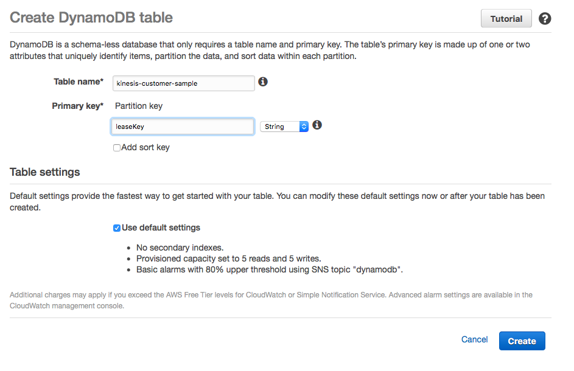

# Amazon Kinesis Cross-Account Client Node.js
This example application uses the official [Amazon Kinesis Client Library for Node.js](https://github.com/awslabs/amazon-kinesis-client-nodejs).  We have simply added support for cross-account access.

Cross-account access is when, in our case, The Washington Post has a Kinesis stream they want to share with an [ARC](http://www.arcpublishing.com) customer.  The Washington Post creates an IAM role that our customer can assume to access our Kinesis stream.

## ARC Customer - Kinesis Consumer Example
If you are an ARC customer and have been given a Kinesis stream with all your stories, images, videos, then this sample is for you!

This Kinesis stream is populated with the following information:
* [Stories](https://github.com/washingtonpost/ans-schema/blob/master/src/main/resources/schema/ans/0.5.7/content_operation.json)
* [Images](https://github.com/washingtonpost/ans-schema/blob/master/src/main/resources/schema/ans/0.5.7/image_operation.json)
* [Videos](https://github.com/washingtonpost/ans-schema/blob/master/src/main/resources/schema/ans/0.5.7/video_operation.json)

## Setup
### Step 1 - The Washington Post
We need to create a DynamoDB table.

The name of the table has to match the "applicationName" found in [properties/kcl.properties](properties/kcl.propertis).  So pick an applicationName, create the DynamoDB table, and let the customer know what it is.

In the AWS console create a DynomoDB table with "leaseKey" as the Primary key.


### Step 2 - ARC Customer
Please tell us your AWS account id.  We need this in step 3.

### Step 3 - The Washington Post
We need to create an IAM User that you can assume.

In the AWS console create a new IAM role.
* Select "Role for Cross-Account Access"
* Then "Allows IAM users from a 3rd party AWS account to access this account."
* Add the Account ID only.  Don't add the External ID, this is not supported by the AWS Kinesis Client yet.


Use this as an example policy.  It uses the ARN from the Kinesis stream and the DynamoDB table.

Example: arn:aws:iam::397853141546:role/kinesis-staging-external

Trust relationship:
```
{
  "Version": "2012-10-17",
  "Statement": [
    {
      "Effect": "Allow",
      "Principal": {
        "AWS": "arn:aws:iam::676590747184:root"
      },
      "Action": "sts:AssumeRole"
    }
  ]
}
```
Policy

```
{
    "Version": "2012-10-17",
    "Statement": [
        {
            "Sid": "Stmt1475084675000",
            "Effect": "Allow",
            "Action": [
                "kinesis:DescribeStream",
                "kinesis:GetShardIterator",
                "kinesis:GetRecords"
            ],
            "Resource": [
                "arn:aws:kinesis:us-east-1:397853141546:stream/com.arcpublishing.staging.content.ans"
            ]
        },
        {
            "Sid": "Stmt1475084967000",
            "Effect": "Allow",
            "Action": [
                "dynamodb:CreateTable",
                "dynamodb:DescribeTable",
                "dynamodb:DeleteItem",
                "dynamodb:GetItem",
                "dynamodb:PutItem",
                "dynamodb:Scan",
                "dynamodb:UpdateItem"
            ],
            "Resource": [
                "arn:aws:dynamodb:us-east-1:397853141546:table/kinesis-customer-sample"
            ]
        },
        {
            "Sid": "Stmt1475085048000",
            "Effect": "Allow",
            "Action": [
                "cloudwatch:PutMetricData"
            ],
            "Resource": [
                "*"
            ]
        }
    ]
}
```

### Step 3 - ARC Customer
Get the DynamoDB table name, IAM Role ARN, and Kinesis stream name from The Washington Post.

Use the DynamoDB table name to populate the "applicationName" found in [properties/kcl.properties](properties/kcl.propertis).

Use the Kinesis stream name to populate the "streamName" found in [properties/kcl.properties](properties/kcl.propertis).

Use the IAM Role to populate the "AWS_ROLE_ARN" found in [docker-compose.yml](docker-compose.yml).

Create an IAM user in your account that can assume the IAM role in The Washington Post account.

After creating the IAM user attach a policy that grants access to the Securty Token Service.  Use the role ARN The Washington Post provided as the Resource.


Example policy:
```
{
    "Version": "2012-10-17",
    "Statement": [
        {
            "Sid": "Stmt1475158944000",
            "Effect": "Allow",
            "Action": [
                "sts:*"
            ],
            "Resource": [
                "arn:aws:iam::397853141546:role/kinesis-staging-external"
            ]
        }
    ]
}
```

Now use your IAM user credentials to populate the AWS_ACCESS_KEY_ID and AWS_SECRET_ACCESS_KEY found in [docker-compose.yml](docker-compose.yml).

